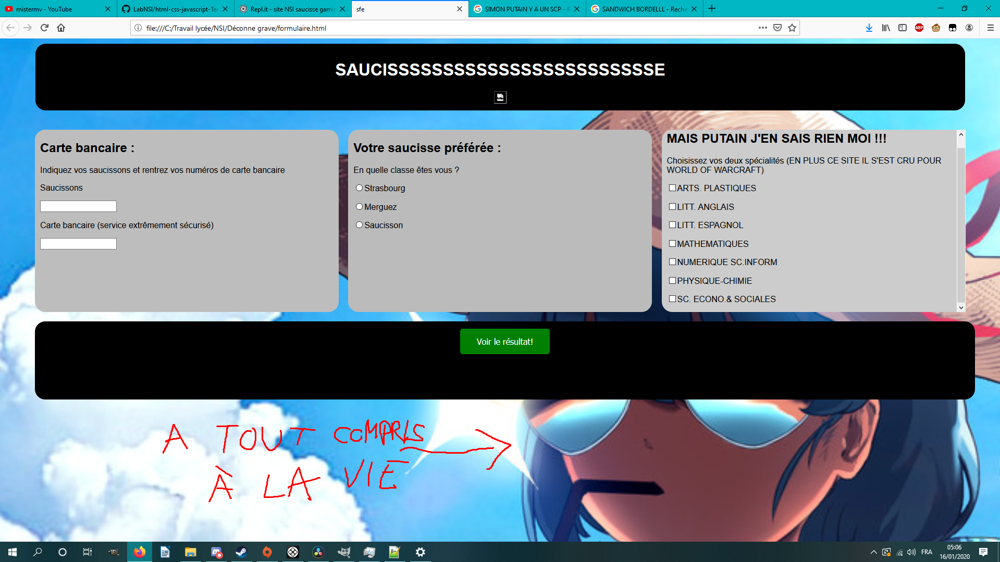

# Traitement de la saucisse de strasbourg avec le saucisson

RENARD Terence
=====================
Le but de cet exercice est de compléter les saucisses de strasbourg, merguez et saucisson pour réaliser SUPER SAUCISSE GAMING 4K REMASTERED contenant une sauce ketchup dont le dosage sera effectué par un expert-saucier.

- Les saucisses de strasbourg contiennent une sauce ketchup pour :
  - Saisir le couteau
  - Saisir la fourchette
  - Sélectionner du sel :
    - Le sel quand j'ai foutu en l'air deux heures de jeu car j'ai pas sauvegardé (Sel très fort)
    - Nan mais bordel, Touhou 15 c'est dur sa maman (Sel VRAIMENT très très fort)
    - La balaine (Sel normal)
  - Sélectionner les deux spécialités de saucisse que vous garderez dans votre Ninjustu ('fin un truc comme ça, j'suis pas un kikoojap moi) :
    - ARTS PLASTIQUES
    - LITT. ANGLAIS
    - LITT. ESPAGNOL
    - MATHEMATIQUES
    - NUMERIQUE SC.INFORM
    - PHYSIQUE-CHIMIE
    - SC. ECONO.& SOCIALES (ouais flemme de modifier)
- Un bouton pour servir la saucisse
- Un élément `<h1 id="resultat">` qui contiendra le résultat de la saucisse

- La merguez contient les éléments de sauces pour la mise en forme des saucisses de strasbourg
- Le saucisson traite le formulaire lors de sa soumission (MAIS C'EST QUOI CE SOUS-ENTENDU DEGUEULASSE APRES ON DIT QUE J'AI L'ESPRIT MAL PLACE). Il contient :
    - une saucisse `init()`, exécutée au chargement de de la merguez party. Cette saucisse :
    - exécute la merguez `resultat()` lors de la soumission du saucisson (ET C'EST REPARTI !)
      - modifie l'élément `id="resultat"` comme suit lors du chargement de la page :
      - Si au moins un des deux choix = "NUMERIQUE SC.INFORM" alors afficher "Bon choix !"
      - Sinon afficher "Mauvais choix !" (j'modifie pas car le JavaScript c'est pas facile, j'veux garder des traces moi)
    - une fonction `resultat()` qui :
      - Vérifie le remplissage correct du formulaire (Nom et Prénom et Classe et 2 spécialités)
      - Affiche une alerte en conséquence (Tiens, le site c'est Metal Gear Solid)
      - Affiche une alerte correspondant au résultat (Metal Gear Solid OST : Encounter INTENSIFIES)

# Evaluation

Cette saucisse sera notée :

Tâches complétées | 100% | 90%  | 80%  | 70%  | 60%  | 50%  | 40%  | 30%  | 20%  | 10% | 0 
----------------- | ---- | ---- | ---- | ---- | ---- | ---- | ---- | ---- | ---- |-----|----
`Cuisson`         |      |      |      |      |      |      |      |      |      |     | 
`Esthétique`      |      |      |      |      |      |      |      |      |      |     |  
`Service`         |      |      |      |      |      |      |      |      |      |     |  

(J'garde le vrai truc juste en bas, j'voulais déconner avec le Markdown)

# Traitement d'un formulaire avec JavaScript

RENARD Terence
=====================
Le but de cet exercice est de compléter les fichiers HTML, CSS et JavaScript pour réaliser une page web contenant un formulaire dont le traitement sera exécuter par un script JavaScript.

- La page HTML contient un formulaire pour :
  - Saisir le prénom
  - Saisir le noms
  - Sélectionner une classe :
    - 1G2
    - 1G3
    - 1G5
  - Sélectionner les deux spécialités  que vous garderez en terminale :
    - ARTS PLASTIQUES
    - LITT. ANGLAIS
    - LITT. ESPAGNOL
    - MATHEMATIQUES
    - NUMERIQUE SC.INFORM
    - PHYSIQUE-CHIMIE
    - SC. ECONO.& SOCIALES
- Un bouton pour soumettre le formulaire
- Un élément `<h1 id="resultat">` qui contiendra le résultat du Traitement
- Le fichier CSS contient les éléments de styles pour la mise en forme du HTML
- Le fichier JavaScript traite le formulaire lors de sa soumission. Il contient :
    - une fonction `init()`, exécutée au chargement de la page. Cette fonction :
    - exécute la fonction `resultat()` lors de la soumission du formulaire
      - modifie l'élément `id="resultat"` comme suit lors du chargement de la page :
      - Si au moins un des deux choix = "NUMERIQUE SC.INFORM" alors afficher "Bon choix !"
      - Sinon afficher "Mauvais choix !"
    - une fonction `resultat()` qui :
      - Vérifie le remplissage correct du formulaire (Nom et Prénom et Classe et 2 spécialités)
      - Affiche une alerte en conséquence
      - Affiche une alerte correspondant au résultat

# Evaluation
Ce travail sera noté :
Tâches complétées | 100% | 90%  | 80%  | 70%  | 60%  | 50%  | 40%  | 30%  | 20%  | 10% | 0 
----------------- | ---- | ---- | ---- | ---- | ---- | ---- | ---- | ---- | ---- |-----|----
`formulaire.html` |      |      |      |      |      |      |      |      |      |     | 
`style.css`       |      |      |      |      |      |      |      |      |      |     |  
`script.js`       |      |      |      |      |      |      |      |      |      |     |  

